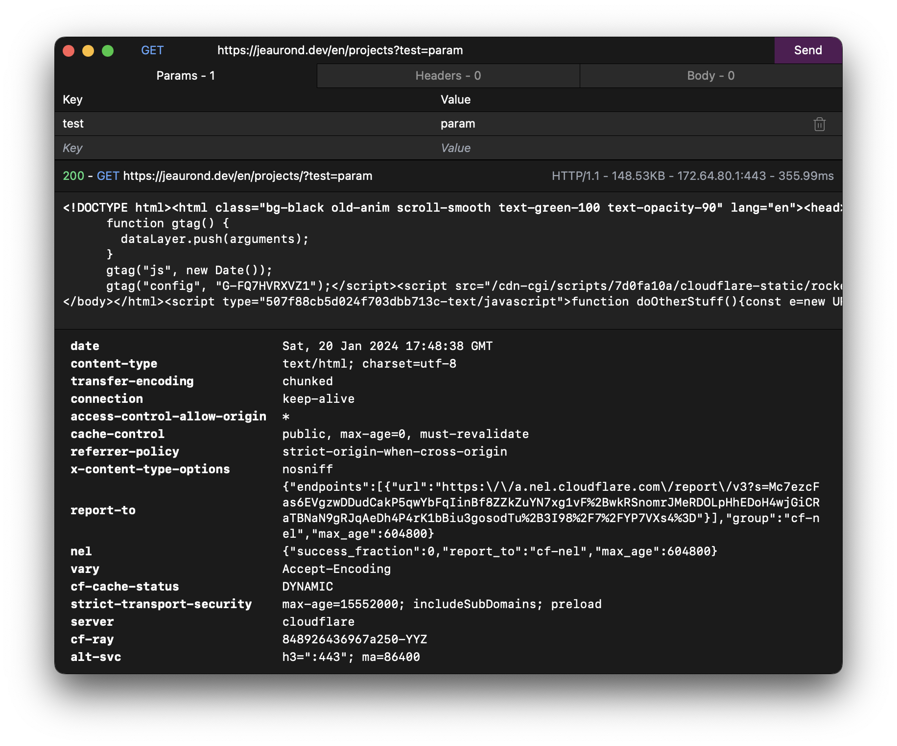

# Reqwest UI

Sometime in 2023, I was dissatisfied with Postman and I decided to try and create a simple HTTP client in Rust and React. My main frustrations with Postman were that:

1. It phones home
2. Many features were behind having an account (I know it's free, but hate the principle)
3. It was slow at times

Ultimately, I'm still using Postman since I didn't spend much time on this project, but it was for sure something interesting to build with [Tauri](https://tauri.app/) and [Reqwest](https://github.com/seanmonstar/reqwest).



# Getting started

This assumes you have Rust, Node.js, and pnpm installed. Simply run the following to run the project locally:

```sh
pnpm i && pnpm tauri dev
```

## Building the application

If you want to create an executable, simply run the following command:

```sh
pnpm tauri build
```

# Performance

I was surprisingly getting slower responses than with Postman, but the startup delay is way smaller. I suspect the difference is due to having not a proper pool of clients and reusing them (although I tried to implement something like that).

On my Mac, the executable is only 11MB in size and takes around ~75MB of memory (which is a bit less than the ~400MB size for Postman on my machine and the ~500MB of memory it takes).
